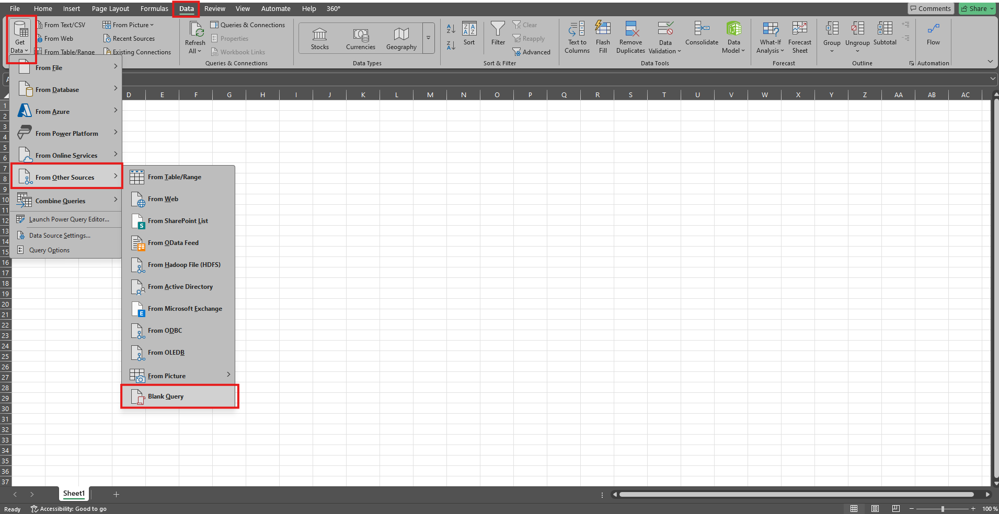
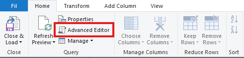
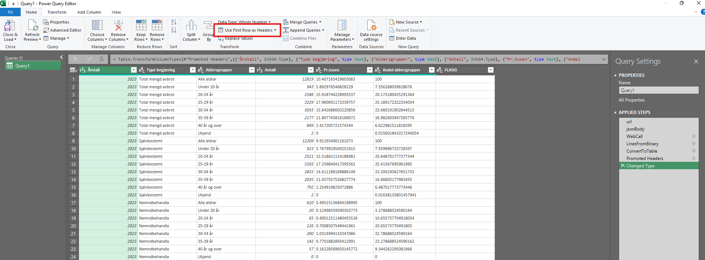

## Fetch data from Fhi Statistikk Open API in Excel
Follow the steps below to fetch data from the Open API.

1. Open a new file in Excel
2. Under "Data", click the option "Get Data" > "From Other Sources" > "Blank Query"

3. A new window will open. Choose "Advanced Editor"

1. Write Power Query code and run the query. Example queries can be fetched using the open API endpoint `api/open/v1/{sourceId}/Table/{tableId}/query`. Please refer to the [Swagger](../../README.md#swagger) and [Endpoints](../../README.md#endpoints) documentation for more information on fetching data and queries from the open API.

Example code for table "Nemdbehandla aborter i pr.tusen (promille)":
```
let
    url="https://app-allvis-api-test.azurewebsites.net/api/open/v1/abr/Table/1134/data",
    jsonBody= "{
        ""dimensions"": [
            {
            ""code"": ""AARGANG"",
            ""filter"": ""item"",
            ""values"": [
                ""2023""
            ]
            },
            {
            ""code"": ""TYPE_BEGJARING_K"",
            ""filter"": ""item"",
            ""values"": [
                ""1"",
                ""99"",
                ""2""
            ]
            },
            {
            ""code"": ""FEMAAR19_40_K"",
            ""filter"": ""item"",
            ""values"": [
                ""99"",
                ""1"",
                ""2"",
                ""3"",
                ""4"",
                ""5"",
                ""6"",
                ""9""
            ]
            },
            {
            ""code"": ""MEASURE_TYPE"",
            ""filter"": ""item"",
            ""values"": [
                ""ANTALL"",
                ""PR1000_1549"",
                ""ANDEL_ALDERSGRUPPER""
            ]
            }
        ],
        ""response"": {
            ""format"": ""csv2"",
            ""maxRowCount"": 50000
        }
    }",
    
    WebCall  =  Web.Contents(url, [Headers=[#"Content-Type"="application/json"], Content=Text.ToBinary(jsonBody)]),
    
    LinesFromBinary = Lines.FromBinary(WebCall),
    ConvertToTable = Table.FromList(LinesFromBinary, Splitter.SplitTextByDelimiter(";"), null, null, ExtraValues.Error)  
in  
    ConvertToTable
```
5. Click "Use First Row as Headers" under the "Transform" tab

6. Click "Close & Load"